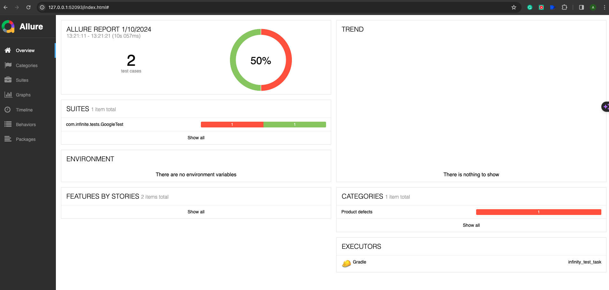
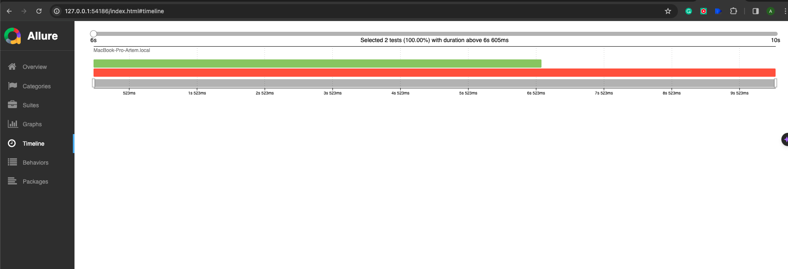
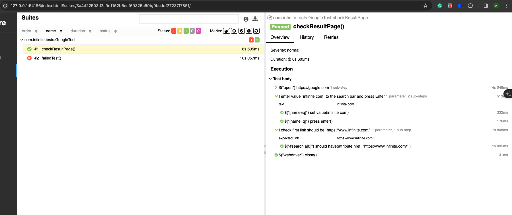
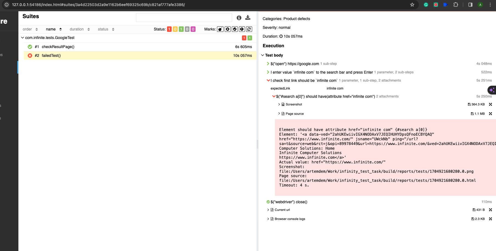

# Test Framework

This repository contains test automation framework for local run in parallel tests used for making test task for **infinite company**.

## Overview

The automation tests in this repository are written in Java and utilize various technologies including:
- `Java`
- `Gradle`
- `Selenide`
- `JUnit`
- `Allure Report`
- `Owner`

## Running the Tests

### Local Execution

To run the tests, use the following command:
```bash
gradle clean test
```

### Remote Execution
```todo - need to implement```

### Allure report

To create allure report after run tests
```bash
allure serve build/allure-results
```

>**Main page**
&nbsp;


>**Tests run in parallel**
&nbsp;


>**Tests contains steps**
> &nbsp;


>**Failed tests have Screenshot, Page Source, Current url, Browser Console logs**
&nbsp;


### Notifications
```todo - need to implement```